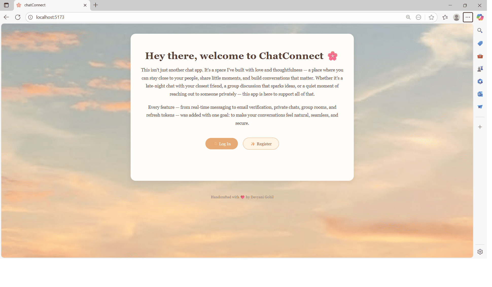
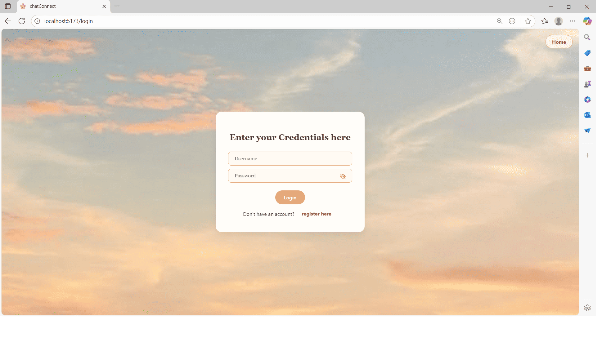
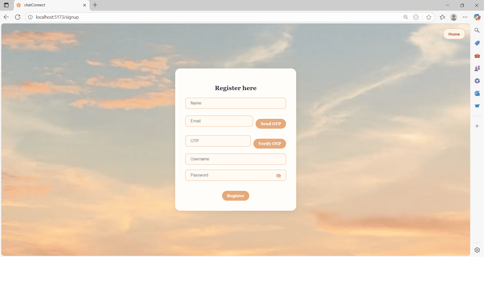
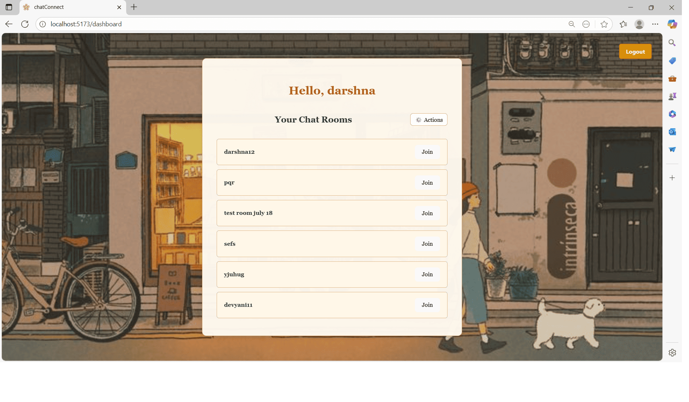
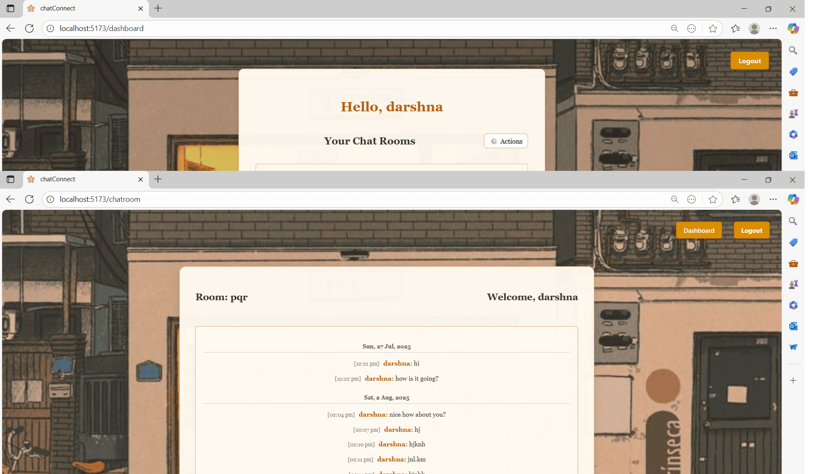

A real-time chat application built with **Spring Boot** (backend) and **React** (frontend), supporting **dynamic chat rooms**, **private messaging**, and **JWT-secured WebSocket communication**.


---

## 🚀 Features

- 🔐 **JWT-based Authentication** (Login & Registration)
- 💬 **Real-Time Messaging** with WebSockets (STOMP)
- 📂 **Dynamic Chat Rooms** – create, join, and manage chat rooms
- 📜 **Message History** – stores messages in the database
- 👥 **Add Users to Chat Rooms** (Admin only)
- ✉ **Join Requests & Invitations**
- 🗑 **Delete Chat History** (coming soon)
- 🎨 **Responsive UI** with modern styling

---

## 🛠️ Tech Stack

### **Backend (Spring Boot)**
- Spring Boot (REST APIs + WebSocket)
- Spring Security + JWT for authentication
- Hibernate/JPA + PostgreSQL for persistence
- STOMP over WebSocket for real-time messaging

### **Frontend (React)**
- React + Hooks
- Axios for API requests
- WebSocket/STOMP client for real-time communication
- Tailwind CSS & custom styles

## 📂 Project Structure


### **Frontend**
```text

frontend/
├── .gitignore
├── eslint.config.js
├── index.html
├── package.json
├── README.md
├── vite.config.js
├── public/
│   └── vite.svg
└── src/
    ├── App.css
    ├── App.jsx
    ├── HomePage.css
    ├── HomePage.jsx
    ├── index.css
    ├── main.jsx
    ├── TokenService.js
    ├── UserContext.jsx
    ├── WebSocketService.js
    ├── api/
    │   └── axiosInstance.js
    ├── assets/
    │   ├── bgimage.jpeg
    │   ├── bgimage2.jpg
    │   ├── bgimage3.jpeg
    │   └── react.svg
    ├── chat/
    │   ├── ChatRoom.jsx
    │   ├── InviteUsersModal.jsx
    │   └── css/
    │       └── ChatRoom.css
    ├── user/
    │   ├── Login.jsx
    │   ├── Register.jsx
    │   └── css/
    │       ├── Login.css
    │       └── Register.css
    └── userdashboard/
        ├── ChatDashBoard.jsx
        ├── FriendRequestList.jsx
        ├── FriendRequestModal.jsx
        ├── JoinRequestList.jsx
        ├── JoinRequestModal.jsx
        ├── PendingFriendRequestsSection.jsx
        ├── PendingRequestsSection.jsx
        ├── SendFriendRequestModal.jsx
        └── css/
            ├── ChatDashboard.css
            └── JoinRequestModal.css
```

### **Backend**
```text

backend/
├── .vscode/
│   └── settings.json
└── chat/
    ├── .gitattributes
    ├── .gitignore
    ├── HELP.md
    ├── mvnw
    ├── mvnw.cmd
    ├── pom.xml
    ├── .mvn/
    │   └── wrapper/
    │       └── maven-wrapper.properties
    ├── .vscode/
    │   └── NEWLY_CREATED_BY_SPRING_INITIALIZR
    ├── src/
    │   └── main/
    │       ├── java/
    │       │   └── com/
    │       │       └── example/
    │       │           └── chat/
    │       │               ├── ChatApplication.java
    │       │               ├── ServletInitializer.java
    │       │               ├── config/
    │       │               ├── controller/
    │       │               ├── dto/
    │       │               ├── mapper/
    │       │               ├── model/
    │       │               ├── repository/
    │       │               ├── service/
    │       │               └── util/
    │       └── resources/
    │           ├── application.properties
    │           ├── static/
    │           └── templates/
    └── target/
        ├── classes/
        │   ├── application.properties
        │   └── com/
        │       └── example/
        │           └── chat/
        │               ├── ChatApplication.class
        │               ├── ServletInitializer.class
        │               ├── config/
        │               ├── controller/
        │               ├── dto/
        │               ├── mapper/
        │               ├── model/
        │               ├── repository/
        │               ├── service/
        │               └── util/
        ├── generated-sources/
        │   └── annotations/
        ├── generated-test-sources/
        │   └── test-annotations/
        └── test-classes/

```
---

## ⚙️ Installation

### **1. Clone the repository**
git clone https://github.com/devyanigohil/chat-app.git

### **2. Backend Setup**
```bash
cd backend/chat
./mvnw spring-boot:run
```
### **3. Frontend Setup**
```bash
cd frontend
npm install
npm run dev
```
## 📸 Screenshots

### **Home Screen**  


### **Login Screen**  


### **Register Screen**  


**Dashboard**  


### **Chatroom**  



### 👩‍💻 Author
### **Devyani Gohil**
🔗 [GitHub](https://github.com/devyanigohil) | 💼 [LinkedIn](https://www.linkedin.com/in/devyani-gohil/)

